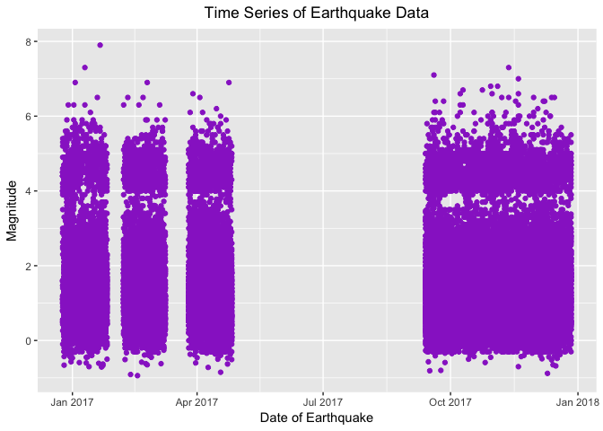
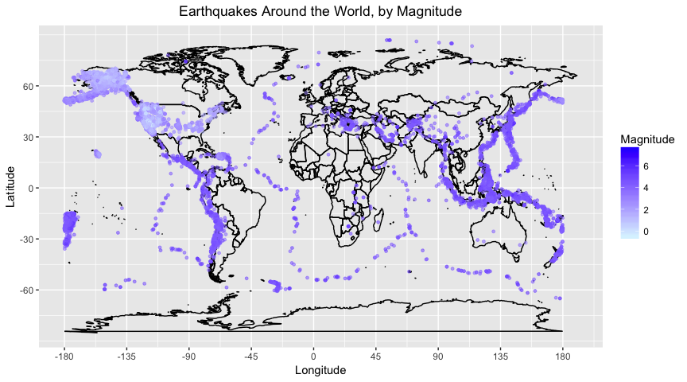
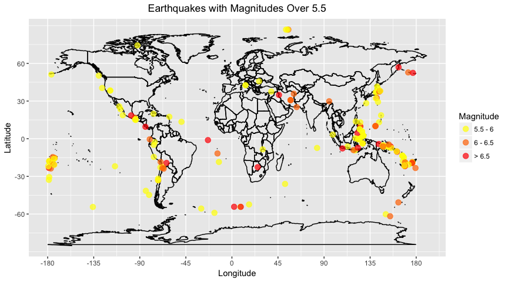
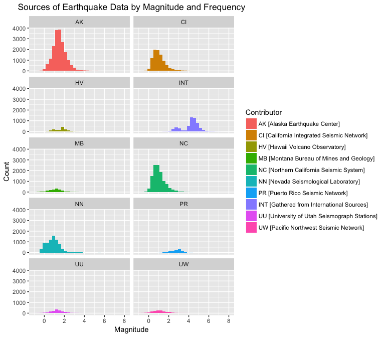
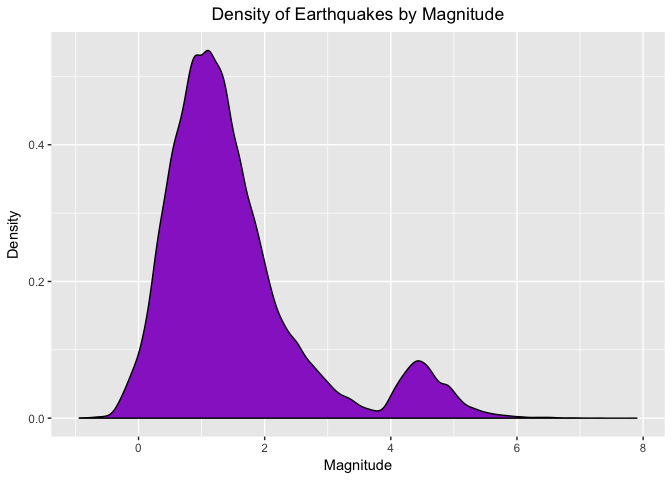
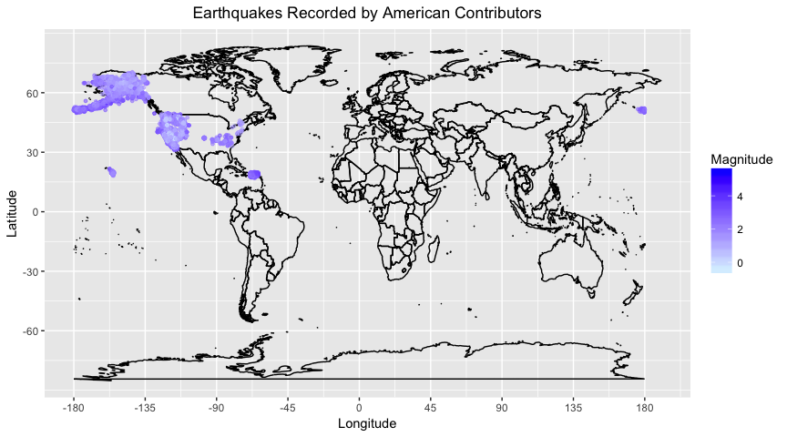
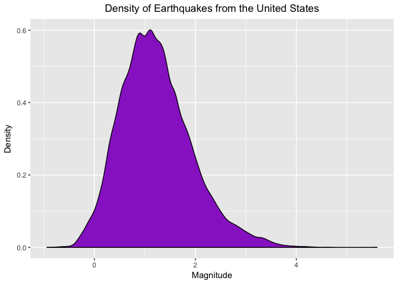

Earthquakes
================
Zach Bernstein, Zack Vanden Bergh, and Nick Hanoian
November 30, 2017

-   [Introduction to the Data](#introduction-to-the-data)
-   [Data Analysis](#data-analysis)
    -   [Global Distribution of Earthquakes](#global-distribution-of-earthquakes)
    -   [Global Distribution of High-Magnitude Earthquakes](#global-distribution-of-high-magnitude-earthquakes)
    -   [Distribution of Quake Magnitude by Significant Data Contributor](#distribution-of-quake-magnitude-by-significant-data-contributor)
    -   [Land-Based versus Sea-Based Earthquakes](#land-based-versus-sea-based-earthquakes)
-   [Conclusions](#conclusions)
-   [Limitations & Recommendations](#limitations-recommendations)

Introduction to the Data
------------------------

The following data is gathered as an observational study to track the patterns of earthquakes on a global scale. The data was provided by the U.S. Geological Survey (USGS), though due to the sheer volume of earthquakes that occur globally (upwards of 9,500 each month), the USGS only publicly provides the last month's worth of data via their GeoJSON API. One of the authors of this analysis, Zach Bernstein, has been gathering this data of his own volition for an independent project on and off since the beginning of the year, storing it into a local database on his computer. There are 59,165 individual records of earthquakes (each with 26 variables) that are used in this analysis. Since the data stored by Zach was only grabbed when he remembered to run the scrip to do so (which was admittedly not very often), the data we have is clearly incomplete, with many gaps in it. The following is a graph of which times of the year 2017 we have data for:

``` r
ggplot(quakes, mapping = aes(x = as.Date(time), y = mag)) +
  geom_point(color='darkorchid') +
  labs(title="Time Series of Earthquake Data",
       x="Date of Earthquake",
       y="Magnitude")+
  theme(plot.title = element_text(hjust = 0.5))  # centers title
```



Since this data takes place within the span of about one year, we aren't able to examine any trends that take place over a long period of time, which is unfortunate considering that there are plenty of interesting trends to be seen on the geological scale of tens of years (or even tens of thousands of years). The data provided by the USGS has upwards of thirty variables that are measured for each quake, such as magnitude, intensity, latitude, longitude, depth, and so on. For this particular examination, we will be focusing on the physical location of the quakes (i.e. latitude/longitude and depth), as well as the magnitude. Each data point is measured by a sensor and automatically logged into the system, and most (if not all) are reviewed and approved by a human as well. This means that there should not be any bias in the data. Despite this checking, however, some of the data might be subject to minor inaccuracies due to technological faults (no pun intended). The data is interesting to look at because we think of earthquakes as such a rare phenomenon, but the reality is that hundreds of tiny earthquakes occur every day, most too small to be felt by humans but powerful enough to be detected by sensitive instruments. The sheer abundance of the data gives us insights into the way our world works, from where tectonic plates are to how powerful earthquakes are in the ocean versus on land.

Data Analysis
-------------

### Global Distribution of Earthquakes

``` r
ggplot(world, aes(x = long, y = lat, group=group)) +
  geom_path() +
  scale_y_continuous(breaks = (-2:2) * 30) +
  scale_x_continuous(breaks = (-4:4) * 45) +
  geom_point(data = quakes, 
             mapping = aes(x=longitude, y=latitude, group=NULL, color=mag), 
             size=1, alpha=0.5)+
  scale_color_gradient(low="lightcyan", high="blue") +
  labs(title='Earthquakes Around the World, by Magnitude', 
       x='Longitude', y='Latitude', color='Magnitude') +
  theme(plot.title = element_text(hjust = 0.5))
```



This graph shows the distribution of earthquakes around the globe. Each recorded earthquake is plotted on a Mercator Projection of the earth. The color of each point is determined by the magnitude.

The outlines of tectonic plates are visible due to the high frequency of earthquakes on their boundaries. There is also a large collection of data points, which begins around Oceania, goes up the east coast of Asia, crosses the Pacific Ocean to Alaska, and moves down the west coasts of the Americas. This area with a high frequency of seismic activity is known as the Ring of Fire. The Ring of Fire is home to over 90 percent of the world's earthquakes and 75 percent of the world's active volcanoes (USGS). One other area of significant amounts of seismic activity is the border between Europe and Africa.

There is also a very high number of low-magnitude earthquakes seen in Alaska and across the United States, which we later find to be due to the high frequency of sensors in the United States.

### Global Distribution of High-Magnitude Earthquakes

``` r
quakes_power <- quakes %>%
  filter(mag > 5.5) %>% 
  mutate(power = factor(case_when(
    mag < 6   ~ 1,
    mag < 6.5 ~ 2,
    TRUE ~ 3 # default case
  )))

ggplot(world, aes(x = long, y = lat, group=group)) +
  geom_path() +
  scale_y_continuous(breaks = (-2:2) * 30) +
  scale_x_continuous(breaks = (-4:4) * 45) +
  geom_point(data = quakes_power, 
             mapping = aes(x=longitude, y=latitude, group=NULL, 
                           color=power), 
             alpha=0.7, size=3) +
  scale_color_manual(values=c('#ffff00','#ff7700', '#ff0000'),
                     labels= c('5.5 - 6', '6 - 6.5', '> 6.5')) +
  labs(title='Earthquakes with Magnitudes Over 5.5',
       x='Longitude', y='Latitude', color='Magnitude') +
  theme(plot.title = element_text(hjust = 0.5))
```



This graph shows the distribution of high magnitude earthquakes around the globe. The data has been filtered to only include earthquakes with a magnitude greater than 5.5. These observations are then mutated with a new variable that is based off of their magnitudes. Earthquakes with a magnitude between 5.5 and 6 are grouped together, ones with a magnitude between 6 and 6.5 are another group, and any earthquake with a magnitude greater than 6.5 is the final group. These groups are reflected by the color of the data points, with the lowest magnitude group being yellow, the middle group being orange, and the highest magnitude group being red.

The trends of high activity areas from the first location-based graph are seen again. The Ring of Fire area, especially around Indonesia and Papua New Guinea, has a large number of high-intensity earthquakes, as does the western coast of the Americas. The large number of earthquakes that were previously seen across the United States are no longer seen, because they were all low magnitude earthquakes.

### Distribution of Quake Magnitude by Significant Data Contributor

``` r
quakes_net_filtered <- quakes %>% 
  group_by(net) %>% 
  filter(n() > 250) %>% 
  mutate(netNamed = case_when( # capitalize network contributors for facet titles
    net == "us" ~ "INT", # denote USGS source
    net %in% c("ak", "ci", "hv", "mb", "nc", "nn", "pr", "uu", "uw") ~ toupper(net), # capitalize
    TRUE ~ "N/A" # default case
  ))

contrib_names <- c("AK [Alaska Earthquake Center]", 
                   "CI [California Integrated Seismic Network]", 
                   "HV [Hawaii Volcano Observatory]", 
                   "MB [Montana Bureau of Mines and Geology]", 
                   "NC [Northern California Seismic System]", 
                   "NN [Nevada Seismological Laboratory]", 
                   "PR [Puerto Rico Seismic Network]", 
                   "INT [Gathered from International Sources]", 
                   "UU [University of Utah Seismograph Stations]", 
                   "UW [Pacific Northwest Seismic Network]")

ggplot(quakes_net_filtered, mapping = aes(x = mag, fill = factor(net, labels=contrib_names))) +
  geom_histogram() +
  facet_wrap(~ netNamed, ncol=2) +
  labs(title='Sources of Earthquake Data by Magnitude and Frequency',
       x='Magnitude', y='Count', fill='Contributor')+
  theme(plot.title = element_text(hjust = 0.5))
```



This graph shows the distribution of earthquake magnitudes for each significant data contributor, which we specified as someone who has submitted more than 250 earthquake events to the dataset. There is a relatively high number of reports from certain contributors, specifically Alaska Earthquake Center. Overall, the amount of data from international sources is dwarfed by the amount submitted by the United States' contributors. Only the facet titled "INT" for international contains data from international sources. All other facets reflect data from the United States.

``` r
ggplot(quakes, mapping = aes(x = mag)) +
  geom_density(fill='darkorchid') +
  labs(title='Density of Earthquakes by Magnitude', x='Magnitude', y='Density')+
  theme(plot.title = element_text(hjust = 0.5))
```



This density plot of magnitude of all of the earthquakes shows a clear bimodal distribution. In order to find out why, we examined the network contributors and came to the conclusion that the reason for the bimodal distribution was that the stations housed in the United States were reporting a very high number of low-intensity earthquakes. This is why the density graph has such a large peak centered at a magnitude of approximately 1. The international data, on the other hand, is mostly larger earthquakes.

``` r
quakes_us <- quakes %>% 
  filter(net!="us")  # anything from the "us" source are earthquakes from global sources aggregated by USGS

ggplot(world, aes(x = long, y = lat, group=group)) +
  geom_path() +
  scale_y_continuous(breaks = (-2:2) * 30) +
  scale_x_continuous(breaks = (-4:4) * 45) +
  geom_point(data = quakes_us, 
             mapping = aes(x=longitude, y=latitude, group=NULL, color=mag), 
             size=1, alpha=0.5)+
  scale_color_gradient(low="lightcyan", high="blue") +
  labs(title='Earthquakes Recorded by American Contributors', 
       x='Longitude', y='Latitude', color='Magnitude') +
  theme(plot.title = element_text(hjust = 0.5))
```



This graph, of only earthquakes submitted by the United States' contributors, makes it clear that the United States contributors are recording a very high number of low-intensity earthquakes.

``` r
ggplot(quakes_us, mapping = aes(x = mag)) +
  geom_density(fill='darkorchid') +
  labs(title='Density of Earthquakes from the United States', x='Magnitude', y='Density')+
  theme(plot.title = element_text(hjust = 0.5))
```



By recreating the previous density plot, but with this new set of data, we see a normal, bell-shaped distribution of magnitudes.

### Land-Based versus Sea-Based Earthquakes

``` r
seabased <- quakes %>% 
  filter(tsunami==1)

quakes_midrange <- quakes %>% 
  filter(mag > floor(min(seabased$mag)), 
         mag < ceiling(max(seabased$mag)))

ggplot(quakes_midrange, mapping = aes(x = mag, fill = factor(tsunami))) +
  geom_density(alpha=.78) +
  scale_fill_manual(labels=c("Land", "Water"), values=c("#3CA000", "#1096C0")) +
  labs(title = "Density of Magnitude of Earthquakes by Environment",
       fill = "Location",
       x = "Magnitude",
       y = "Density")+
  theme(plot.title = element_text(hjust = 0.5))
```


One of the variables in the data is called "tsunami", and it indicates whether or not the earthquake took place on land or at sea. Despite the name of the variable, having "tsunami" set to 1 does not mean that there was or will be a tsunami associated with the event. The above graph shows that earthquakes measured at sea have a higher magnitude on average than quakes measured on land. There are plenty of possible reasons for why this is the case - for example, it might be that the low-magnitude quakes measured at sea cannot be recorded since they're too weak to be felt by land-based measuring stations, or it could be because the international community has a tendency to report only high-magnitude quakes. Yet another reason for the phenomenon could be that the pressure of water on the fault lines provokes more intense earthquakes than the pressure of the air does on land-based fault lines. We do not know the actual reason for why this phenomenon exists in the data, only that it does. We won't be able to come to a concrete solution based on this graph alone, since correlation does not imply causation.

Conclusions
-----------

From our graph of the global distribution of earthquakes, we saw that plotting the location of a large number of earthquakes can be used to find tectonic plates. This trend is seen again in the graph showing only high-magnitude earthquakes. These earthquakes occur almost exclusively on plate boundaries.

Our analysis of different data contributors also gave some interesting results. We learned that the United States records even the smallest seismic activities, which causes them to have a very large number of observations compared to the international community. This causes our data to have a bimodal distribution in regards to magnitude, as seen in our "Density of Earthquakes by Magnitude" graph. Once we isolated the United States' data, we saw that, in general, earthquake magnitudes follow a normal distribution.

Finally, from the land-based versus sea-based analysis we found that earthquakes at sea generally have a higher magnitude than those found on land. We were not able to find a definitive cause of this, but we did speculate a few possible causes.

Limitations & Recommendations
-----------------------------

Since the data that we used in this project was only gathered in the last year, it is not possible for us to look at any long-term trends. We compiled all of the current data into a CSV file so any earthquakes that would be logged after we compiled it would be excluded from our project. Additionally, machine malfunctions could have thwarted reliability of the data.

In the future we could expand the study outside of the US-centric data agencies. It makes sense that USGS would have data that are mostly focused in the United States, and sourcing data from other countries' government agencies would increase the accuracy of global earthquake data. Additionally, we could benefit from adding more sensing stations in more places to get a wider range of data.
